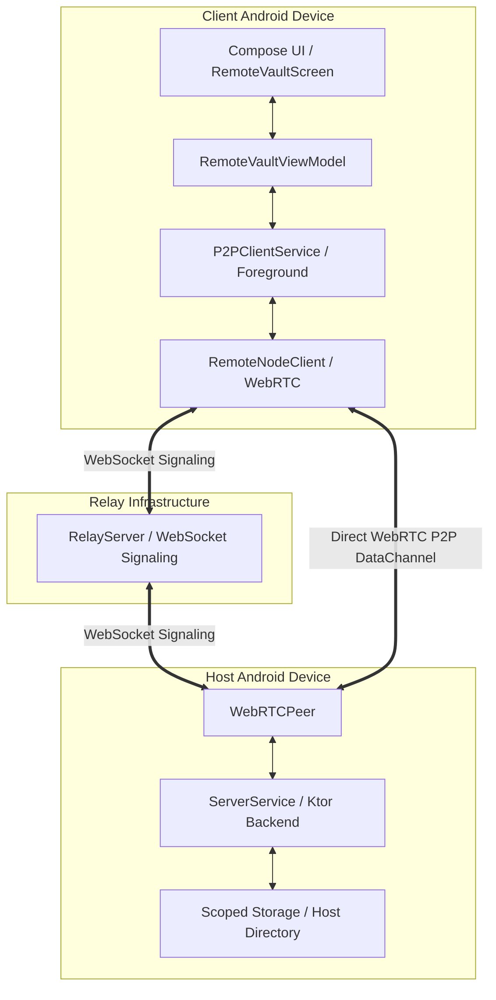

# Remote Vault — Secure Peer-to-Peer File Sharing

The **Remote Vault** is a high-performance, secure, and fully-featured native file-sharing subsystem integrated into the Android Cloud Storage Application. It enables direct, peer-to-peer (P2P) communication between two Android devices, bypassing traditional cloud storage intermediate servers to stream, upload, search, and manage files securely. 

This document provides a comprehensive technical overview, an in-depth list of implemented features, and an elaborate description of the state-of-the-art UI/UX design language utilized in the Jetpack Compose front-end.

---

## 1. Architectural Architecture & Connection Flow

The Remote Vault is architected to prioritize user privacy, transport speeds, and battery efficiency. Instead of utilizing standard client-server HTTP configurations over public web endpoints, it uses **WebRTC DataChannels** facilitated by an ephemeral signaling handshake.

### P2P Protocol Hierarchy



### Security & Lifecycle Handshake
1. **P2P Establishment**: The client inputs the host's 5-6 character **ShareCode**. The WebRTC stack establishes a secure, end-to-end encrypted connection between the devices.
2. **Token-Based Handshake**: Rather than exposing raw credentials over the network continuously, the client captures the Vault **Passkey/Passphrase** at startup. Upon WebRTC `files` DataChannel opening, the client executes an initial auth handshake request: `POST /api/auth` with the password payload.
3. **Session Token Issuance**: The Host validates the passphrase and replies with a secure, cryptographically random, ephemeral **Session Token**. 
4. **Authorized Requests**: The client securely stores this session token in memory. All subsequent CRUD requests (`files`, `download`, `delete`, `upload`) include this Token in the `Authorization: Bearer <token>` header, mirroring the exact security posture of production-grade REST APIs.

---

## 2. Implemented Features

### 📂 Native Remote File Explorer
* **Directory Traversing**: Recursively traverses deep directories hosted on the Remote Node with breadcrumb-based navigation.
* **Storage Analytics**: Fetches and displays real-time server disk diagnostics (`total`, `used`, and `free` bytes) via the `/api/storage` endpoint.
* **Extensive File Meta**: Displays complete metadata including file names, precise sizes, file types, extensions, and relative timestamps (e.g., *"3m ago"*, *"2h ago"*).

### 🔍 Real-Time Search & Sorting Controls
* **Fuzzy Search**: Filter remote directory content instantly as the user types without incurring network overhead.
* **Multi-Attribute Sorting**: Instant local sorting supporting five distinct modes:
  * **Name (A-Z / Z-A)**
  * **Size (Smallest / Largest)**
  * **Recent (Modified Date descending)**
* **Category Partitioning**: Always prioritizes folders above files, keeping explorer paths clean and structural.

### ⚡ Bidirectional Chunked File Transfers
* **Chunked Downloads**: Streams files in binary packets over WebRTC. Dynamic chunk parsing prevents main-thread blockages, allowing seamless execution.
* **Optimized Chunked Uploads**: Implemented **64KB chunking** to respect strict Android socket buffer ceilings, completely avoiding `BufferOverflow` crashes while maintaining maximum P2P bandwidth.
* **Foreground Service Persistence**: Transfers run inside `P2PClientService` (an Android Foreground Service) backed by a `PowerManager.WakeLock`. Transfers continue uninterrupted even when the app is backgrounded or the screen goes black.
* **System Notification Engine**: Displays ongoing transfers in the Android status bar with an active progress bar, estimated speeds, and final success/error completion banners.

### 🛡️ Storage Safety & System Share Intents
* **Scoped Storage Fallback**: Downloaded files are saved to the device's public `Downloads/EasyStorage/` directory, ensuring files are instantly visible in native Android File Managers and survive app cache wipes.
* **FileProvider Integration**: Seamlessly integrates Android's `FileProvider` to request temporary secure read permissions.
* **Native Viewing & Sharing**: Allows users to immediately open files using system default applications (via `Intent.ACTION_VIEW`) or share them instantly with close contacts (via `Intent.ACTION_SEND` Share Sheets) directly from the explorer interface.

### 🗑️ Remote Deletion Interface
* **Base64 Path Payload**: Enables direct file deletion from the Host storage via WebRTC-routed HTTP `DELETE` queries, using base64 URL encoding to guarantee file-path strings are safely transmitted without corruption.

---

## 3. Premium UI/UX Design Description

The Remote Vault user interface is meticulously styled using a bespoke Material 3 OLED-optimized Dark Design System. It features rich gradients, glassmorphism elements, high-definition typography, and buttery-smooth micro-animations.

### 🎨 Color Palette & Spacing Tokens

The visual style is characterized by an ultra-premium dark cyberpunk palette that stands out visually, avoiding flat browser defaults.

| Token Name | Hex Value | Purpose | Visual Effect |
| :--- | :--- | :--- | :--- |
| `BgDeep` | `#060A14` | Root Background | Pitch black, OLED-friendly base |
| `BgPrimary` | `#0B1220` | Secondary Background | Deep navy backdrop to create visual hierarchy |
| `BgSurface` | `#111827` | Card/Sheet Surfaces | High-contrast container fill |
| `BgCard` | `#161E2E` | Card Inner Borders | Interactive component highlight |
| `BorderDefault`| `#1E293B` | Structural Dividers | Sophisticated, thin slate boundaries |
| `AccentBlue` | `#3B82F6` | Primary Interactive Color | Vibrant electric blue for buttons, progress, focus |
| `AccentGreen` | `#22C55E` | Success Indicator | Bright forest green for completed transfers |
| `AccentRed` | `#EF4444` | Warning / Deletion | Signal color for destructive actions and disconnects |
| `FolderGold` | `#FBBF24` | Folders | Warm amber glow matching standard OS environments |

---

## 4. UI Screen & State Breakdown

### A. Connection & Handshake Terminal (`ConnectScreen`)

The entry screen displays a highly polished connection deck where the user inputs signaling and authentication criteria.

```
+-------------------------------------------------------+
|                                                       |
|                     ( ( ( 📡 ) ) )                    |
|                    Connection Radar                     |
|                                                       |
|                     Remote Vault                      |
|           Connect securely via peer-to-peer           |
|                                                       |
|   +-----------------------------------------------+   |
|   | SHARE CODE                                    |   |
|   | [               E A S Y 7                 ]   |   |
|   |                                               |   |
|   | USERNAME                                      |   |
|   | [ 👤 pratham                             ]   |   |
|   |                                               |   |
|   | PASSKEY                                       |   |
|   | [ 🔒 •••••••••••••                       ]   |   |
|   +-----------------------------------------------+   |
|                                                       |
|   [================= Establish P2P Link ============] |
|                                                       |
|         [🛡️ End-to-end encrypted • WebRTC P2P]         |
+-------------------------------------------------------+
```

1. **Connection Radar Visualizer (`ConnectionRadar`)**: 
   * A glowing antenna icon is enclosed within a concentric orbital mesh. 
   * When establishing a link, Compose's `rememberInfiniteTransition` triggers a continuous **scale pulse** (scalar `0.8f` to `1.2f`) combined with a **fading alpha cycle** (`0.3f` to `0.08f`), conveying a live network ping visually.
2. **Interactive Credentials Deck**:
   * Uses high-contrast `OutlinedTextField` boxes styled with a custom cursor color (`AccentBlue`) and card container backgrounds (`BgCard`).
   * The **Share Code Input** automatically capitalizes inputs, formats text in `FontFamily.Monospace`, sets letters to a bold size (`22.sp`), and adds explicit letter-spacing (`4.sp`) for maximum legibility.
   * **Passkey Masking**: Uses `PasswordVisualTransformation` to ensure raw passwords are never visually leaked.
3. **Signal Step Tracker (`ConnectionSteps`)**:
   * Appears dynamically using a sliding expansion animation once the connection starts.
   * Renders three chronological milestones: **Signaling**, **ICE Negotiation**, and **Authenticating**. 
   * Active nodes show a looping `CircularProgressIndicator` alongside glowing text, while completed stages get marked with bright status dots.

---

### B. Dynamic File Explorer (`FileExplorerScreen`)

Once connected, the UI smoothly transitions to a dual-column modular workspace displaying the remote directory layout.

```
+-------------------------------------------------------+
| 🟢 EASY7  [■■■■■■■□□□□□□□□] 2.1 GB / 8 GB   🔍 📥 🔄 ❌|
+-------------------------------------------------------+
|  [ Name ↑ ] [ Name ↓ ] [ Size ↑ ] [ Size ↓ ] [ Recent ]  |
+-------------------------------------------------------+
|  📂 Root / Documents / Work                           |
|  2 folders · 1 file                                   |
+-------------------------------------------------------+
|  [📁] Financials_2026                      Folder  >  |
|  ---------------------------------------------------  |
|  [📄] Annual_Report.pdf                     84.3 MB >  |
|      Downloading · 42%                                |
|      [====== Progress: 42% ======]                    |
+-------------------------------------------------------+
|                                  +-----------------+  |
|                                  |   [📤 Upload]   |  |
+-------------------------------------------------------+
```

1. **Information HUD (Top Bar)**:
   * **Status Badge**: A capsule-shaped pill highlighting the active `ShareCode` colored in `AccentGreen` with a pulsing status node.
   * **Storage Bar**: A linear indicator that tracks remote storage usage in real-time. If disk capacity exceeds **90%**, the track color automatically flips from `AccentBlue` to `AccentRed` via standard state mapping.
   * **System Control Row**: Includes quick actions to search, open the download manager, force-refresh, and close the session.
2. **Fuzzy Filter & Navigation Deck**:
   * **Collapsible Search**: Slides open with an `expandVertically()` animation. It features a modern leading search icon and a trailing clear button that only displays when a search query is active.
   * **Sort Chips Row (`SortChips`)**: A smooth, horizontally scrolling `LazyRow` featuring five sorting options. Active filters are highlighted with a glowing blue border and matching background tint.
   * **Breadcrumbs (`BreadcrumbText`)**: Visually charts the folder directory path with a home icon and slate-gray chevron splitters (`ChevronRight`), allowing the user to tap any parent directory to traverse back instantly.

---

### C. Rich File Cards (`FileCard`)

Individual files are represented by card elements packed with dynamic visual signals.

```
+-------------------------------------------------------+
|  [ 📄 ]  Annual_Report.pdf                            |
|          84.3 MB  ·  PDF  ·  just now                 |
|          Downloading · 42%                 (( 42% ))  |
|  [==================================================] |
+-------------------------------------------------------+
```

1. **Color-Coded File Icons**:
   * File types feature specialized icons enclosed in custom low-opacity tinted capsules:
     * **Images**: Cyan (`#0284C7`) image icon.
     * **Videos**: Pink (`#DB2777`) video player icon.
     * **Audio**: Violet (`#7C3AED`) music note.
     * **PDFs**: Red (`#DC2626`) document outline.
     * **Archives (ZIP/RAR)**: Gold (`#D97706`) folder zip icon.
     * **Documents (Word/TXT)**: Blue (`#2563EB`) page outline.
     * **System Packages (APK)**: Neon Green (`#16A34A`) Android outline.
2. **File Selection Mode**:
   * Triggered by **long-pressing** any file. Checkboxes (`RadioButtonUnchecked` or `CheckCircle`) smoothly animate into the card's leading edge, replacing the file type icons. Tapping files in this mode toggles their selection state, accompanied by a soft background highlight (`AccentBlue.copy(alpha = 0.08f)`).
3. **Inline Transfer Feedback**:
   * When a file download starts, the right chevron morphs into a circular progress meter showing the download percentage. A corresponding linear progress bar animates across the bottom edge of the file card, keeping the user informed without breaking their exploration flow.

---

### D. Overlay & Sheets Ecosystem

The application features three highly polished overlay systems to handle specific actions, ensuring the interface feels dynamic and fluid.

#### 1. Multi-Select Control Panel (`SelectionBar`)
Slides up from the bottom when files are selected, providing a clean interface for bulk actions.

```
+-------------------------------------------------------+
| 3 selected             [ All ] [ Clear ]  (📥 Download) |
+-------------------------------------------------------+
```

* **Action Items**: Includes quick buttons to "Select All" or "Clear" current selections.
* **Bulk Download Button**: A tinted button highlighting the selection count. Tapping it issues concurrent download requests for all selected items.

---

#### 2. Detailed Metadata Sheet (`FileDetailSheet`)
Tapping a file card opens a custom modal sheet from the bottom, offering comprehensive info and file controls.

```
+-------------------------------------------------------+
|                     [====]                            |
|                                                       |
|  [ 📄 ]  Annual_Report.pdf                            |
|          84.3 MB · PDF · May 23, 2026                 |
|                                                       |
|  [📂 Open]          [📤 Share]          [🗑️ Delete]    |
+-------------------------------------------------------+
```

* **File Info**: Shows a high-contrast file icon, precise file size, type, and modified timestamp.
* **Smart Actions**: Action buttons adjust dynamically based on file status:
  * **Not Downloaded**: Displays a **Download** action.
  * **Downloaded**: Displays **Open** (uses system intents) and **Share** (opens Android Share Sheet) options side-by-side.
  * **Delete**: A high-impact red button (`AccentRed`) with a warning boundary, allowing remote file deletion.

---

#### 3. Floating Transfer Monitor (`TransferProgressOverlay`)
A dynamic floating panel overlaying the screen to track transfers, featuring collapsibility.

```
+-------------------------------------------------------+
| 📥 Annual_Report.pdf                  42%  1.2 MB/s 🔼|
| [===================                  ]               |
+-------------------------------------------------------+
```

* **Collapsed View**: A clean floating pill anchored at the bottom of the active view. Shows the primary filename, active transfer speed (formatted dynamically as *KB/s* or *MB/s*), and overall transfer percentage.
* **Expanded View**: Tapping the header expands the panel to show a detailed list of up to ten active transfers, complete with independent file progress bars, transfer speeds, and exact byte counts.
* **Transitions**: Utilizes `animateFloatAsState` to deliver fluid progress transitions and `AnimatedVisibility` to handle collapse/expansion actions smoothly.

---

## 5. Technical Specification & API Route Routing

The client and host communicate over the WebRTC DataChannel using a structured JSON request/response schema.

### Directory Listing (`GET /api/files`)
* **Request Structure**:
  ```json
  {
    "requestId": "uuid-string",
    "method": "GET",
    "path": "/api/files?path=/Documents",
    "headers": {
      "Authorization": "Bearer <session_token>"
    }
  }
  ```
* **Response Structure**:
  ```json
  {
    "status": 200,
    "body": "[{\"id\":\"1\",\"name\":\"Report.pdf\",\"path\":\"/Documents/Report.pdf\",\"size\":84300222,\"isDirectory\":false,\"lastModified\":1779466095000}]"
  }
  ```

### Binary Chunk Stream (`GET /api/download`)
* **Request Structure**:
  ```json
  {
    "requestId": "uuid-string",
    "method": "GET",
    "path": "/api/download?path=/Documents/Report.pdf",
    "headers": {
      "Authorization": "Bearer <session_token>"
    }
  }
  ```
* **Transmission Lifecycle**:
  ```
   Client                    DataChannel                    Host
     |                            |                           |
     | ----- sendRequest() -----> |                           |
     |                            | <------ res-start ------- | [Prepares buffer]
     |                            | <--- binary packet #1 --- | [64KB base64 packet]
     |                            | <--- binary packet #2 --- | [64KB base64 packet]
     |                            | <--- binary packet ... -- | 
     |                            | <------- res-end -------- | [Closes local file]
     v                            v                           v
  ```

### Storage Diagnostics (`GET /api/storage`)
* **Response Structure**:
  ```json
  {
    "status": 200,
    "body": "{\"total\":85899345920,\"used\":22548578304,\"free\":63350767616}"
  }
  ```

### Remote File Deletion (`DELETE /api/delete`)
* **Request Structure**:
  ```json
  {
    "requestId": "uuid-string",
    "method": "DELETE",
    "path": "/api/delete?path=%2FDocuments%2FReport.pdf",
    "headers": {
      "Authorization": "Bearer <session_token>"
    }
  }
  ```
* **Response Structure**:
  ```json
  {
    "status": 200,
    "body": "{\"success\":true}"
  }
  ```
